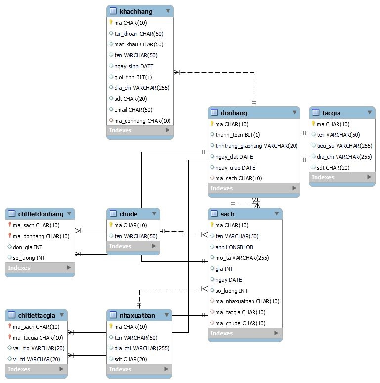

# BÀI TẬP SQL

Repo này gồm các bài thực hành thiết kế cơ sở dữ liệu bằng MySQL/MariaDB:

- `exercise_1`: quản lý danh sách học viên và các truy vấn lọc cơ bản.
- `exercise_2`: quản lý khách hàng, hóa đơn, sản phẩm và loại sản phẩm.
- `exercise_crm`: mô hình CRM đơn giản với nhóm, tài khoản, trạng thái và công việc.
- `exercise_summary`: mô hình đặt vé xem phim gồm cụm rạp, rạp, ghế, phim, người dùng và vé.
- `bai_tap_nop`: bài nộp quản lý bán sách.

## Summary thay đổi

- Bổ sung `Summary` và comment theo khối cho toàn bộ file SQL.
- Thêm `CREATE DATABASE IF NOT EXISTS` và `USE` vào các file bảng để tránh chạy nhầm database.
- Đưa khóa ngoại vào ngay phần `CREATE TABLE` thay vì thêm cột bằng nhiều lệnh `ALTER TABLE`.
- Chuẩn hóa một số quan hệ: hóa đơn/đơn hàng trỏ về khách hàng, sản phẩm trỏ về loại sản phẩm, ghế trỏ về rạp và loại ghế, sách nối tác giả qua bảng trung gian.
- Chuẩn hóa kiểu dữ liệu: cột tiền dùng `DECIMAL(12, 2)`, cột đúng/sai dùng `BOOLEAN`, khóa số tự tăng dùng `INT`.
- Đổi chuỗi SQL sang dấu nháy đơn để tránh phụ thuộc cấu hình `ANSI_QUOTES`.
- Dữ liệu mẫu dùng `ON DUPLICATE KEY UPDATE` để có thể chạy lại mà không nhân bản bản ghi.
- Đặt alias rõ ràng cho các truy vấn tổng hợp và sửa điều kiện lọc không khớp dữ liệu mẫu.

## Thứ tự chạy gợi ý

Nếu đã từng chạy phiên bản cũ, nên xóa database bài tương ứng rồi chạy lại theo thứ tự dưới đây để tránh xung đột schema cũ.

### `exercise_1`

```sql
SOURCE exercise_1/student.sql;
SOURCE exercise_1/baitap1.sql;
```

### `exercise_2`

```sql
SOURCE exercise_2/khachhang.sql;
SOURCE exercise_2/loaisanpham.sql;
SOURCE exercise_2/sanpham.sql;
SOURCE exercise_2/hoadon.sql;
SOURCE exercise_2/chitiethoadon.sql;
SOURCE exercise_2/baitap2.sql;
```

### `exercise_crm`

```sql
SOURCE exercise_crm/baitapcrm.sql;
SOURCE exercise_crm/groups.sql;
SOURCE exercise_crm/accountscrm.sql;
SOURCE exercise_crm/status.sql;
SOURCE exercise_crm/tasks.sql;
```

### `exercise_summary`

```sql
SOURCE exercise_summary/cumrap.sql;
SOURCE exercise_summary/rap.sql;
SOURCE exercise_summary/loaighe.sql;
SOURCE exercise_summary/ghe.sql;
SOURCE exercise_summary/phim.sql;
SOURCE exercise_summary/chitietphim.sql;
SOURCE exercise_summary/loainguoidung.sql;
SOURCE exercise_summary/nguoidung.sql;
SOURCE exercise_summary/datve.sql;
SOURCE exercise_summary/baitaptonghop.sql;
```

### `bai_tap_nop`

```sql
SOURCE bai_tap_nop/chude.sql;
SOURCE bai_tap_nop/nhaxuatban.sql;
SOURCE bai_tap_nop/tacgia.sql;
SOURCE bai_tap_nop/sach.sql;
SOURCE bai_tap_nop/khachhang.sql;
SOURCE bai_tap_nop/donhang.sql;
SOURCE bai_tap_nop/chitiettacgia.sql;
SOURCE bai_tap_nop/chitietdonhang.sql;
SOURCE bai_tap_nop/qlbansach.sql;
```

## Hình ảnh demo

<p align="center">
  
</p>
